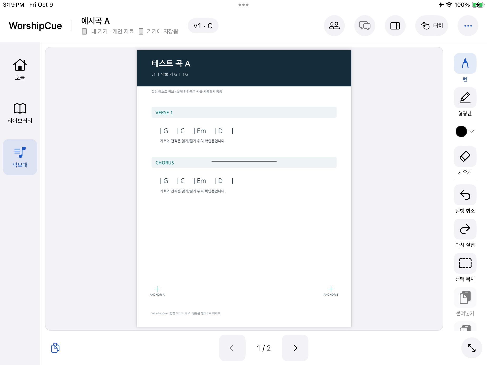
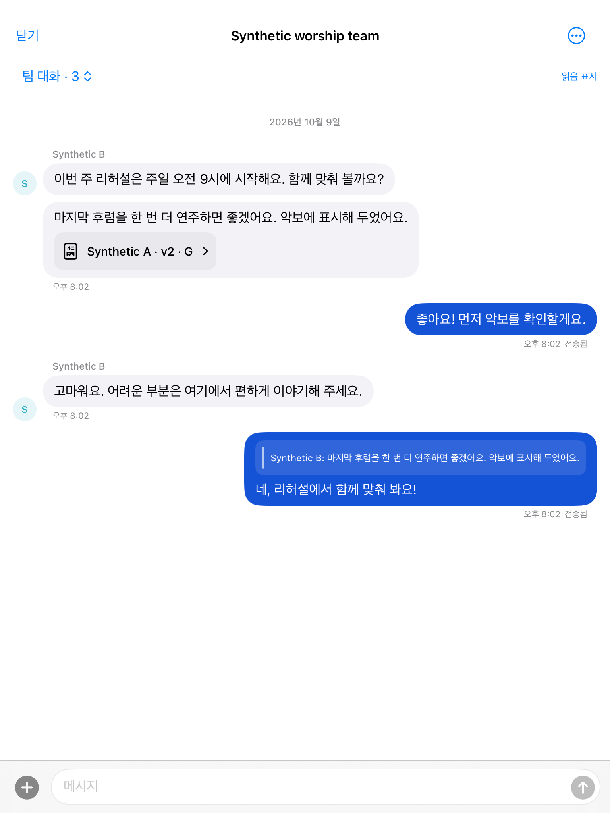
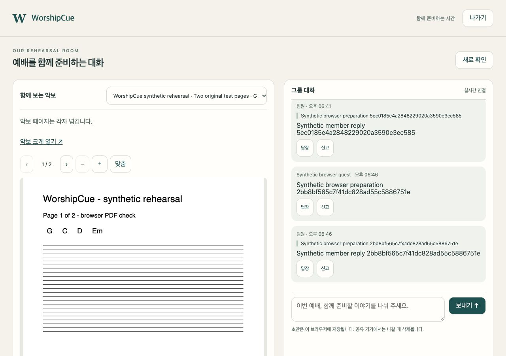

<p align="center"></p>
<h1 align="center">WorshipCue</h1>
<p align="center"><strong>악보와 필기는 각자 편하게. 곡 안내와 팀 필기는 함께.</strong></p>
<p align="center"><a href="README.md">English</a> · <a href="CHANGELOG.md">기능·수정 이력</a> · <a href="docs/ENGINEERING.md">설계와 구현</a> · <a href="verification/STATUS.md">검증 현황</a></p>

찬양팀의 PDF 편곡 악보, 개인 필기, 이번 주 곡 목록과 팀 대화를 하나의 리허설 흐름으로 연결하는 한국어 중심 iPad 네이티브 앱입니다. 연주자는 자기 악보와 페이지를 직접 선택하고, 리더는 팀 표시와 조용한 곡 안내를 전달합니다.

**[Aiden Rhaa](https://github.com/manynames3)**의 제품·엔지니어링 프로젝트입니다. iPad 화면과 필기부터 오프라인 저장, 팀 권한, 클라우드 운영과 브라우저 동반 화면까지 이어지는 구현 과정은 [설계와 구현 문서](docs/ENGINEERING.md)에 정리했습니다.

> **현재 개발 중이며 App Store 출시 버전은 아닙니다.** 이 소개에는 실제 로컬 Build 19까지의 작업이 포함됩니다. 공개 앱 소스는 `main`과 `v1`의 Build 3, `v2`의 Build 8 체크포인트이며 이후 소스는 아직 공개되지 않았습니다. [빌드·공개·검증 현황](verification/STATUS.md#publication-and-builds).

## 왜 만들고 있나요?

리허설에서 준비하는 것은 PDF 한 장만이 아닙니다. 브리지 반복 횟수, 보컬 진입, 건반 보이싱, 쉬어야 할 마디와 실제로 연습한 편곡 버전이 함께 쌓입니다. 새 악보가 왔다고 그 준비를 잃고 싶지는 않습니다. 예배 중 다음 곡 안내를 받더라도 연주 중인 페이지가 갑자기 바뀌어서는 안 됩니다.

WorshipCue는 PDF로 연습하는 연주자와 보컬, 연주하면서 팀을 이끄는 밴드마스터를 위해 만들고 있습니다. **개인 준비는 오래 쓸 수 있게, 팀의 변화는 분명하게, 악보 이동은 각자의 타이밍에** 할 수 있도록 설계했습니다.

## 리허설에서 이렇게 사용합니다

| 이런 순간에 | 제공하는 경험 |
| --- | --- |
| 어떤 편곡으로 연주하나요? | 버전별 라이브러리, 즐겨찾기, 직접 지정한 기본 악보와 정확한 버전을 선택하는 곡 목록. 한국어 초성·별칭·찬송가 번호로도 찾습니다. |
| 새 악보에도 이전 필기가 필요해요. | 원본과 필기는 남겨 두고 필요한 획만 선택합니다. 다른 버전에서 위치·크기를 미리 본 뒤 붙여넣기를 확정합니다. |
| 진입 마디를 빨리 표시하고 싶어요. | 펜·형광펜·지우개·실행 취소와 작은 색상 팝업. 펜과 형광펜은 색상을 따로 기억합니다. |
| 이번 주 악보가 이 iPad에 준비됐나요? | 순서와 대기곡을 정하고 PDF 준비 상태와 메모 확인 상태를 곡별로 확인·재시도합니다. 준비된 로컬 악보와 개인 필기는 오프라인에서도 사용합니다. |
| 리더가 두 번째 후렴을 수정했어요. | 같은 연주 항목·악보 버전·페이지에 맞는 팀 표시를 봅니다. 내 개인 필기는 별도 레이어에 남습니다. |
| 마지막 부분은 어떻게 하기로 했죠? | 팀·곡 목록별 대화, 답장, 악보 링크, 고정 메시지와 읽지 않음·음소거 기능으로 준비 내용을 모읍니다. |
| 게스트에게 악보와 대화를 보여 주고 싶어요. | 한 대화방과 한 예배의 공개된 팀 악보에만 연결되는 취소 가능한 브라우저 링크. 이름을 입력하면 앱 설치 없이 참여합니다. |
| 다음 곡으로 넘어갑니다. | 조용한 화면 안내를 받고 준비됐을 때 직접 엽니다. 페이지는 각자 넘깁니다. |

기능마다 검증 범위가 다릅니다. 실제 두 iPad 리허설, 최종 제스처 확인 등은 남아 있으며 [검증 현황](verification/STATUS.md)에 통과·실패·미검증 결과를 함께 기록했습니다.

## 실제 구현 화면

<p align="center"></p>

악보를 중심에 두고 필기 도구와 페이지 이동을 가까이 배치했습니다. 전체 화면 진입 버튼은 오른쪽 아래에 있습니다.

<p align="center"></p>

익숙한 메시지 말풍선, 묶인 발신자 표시와 악보 링크로 팀 대화를 이어갑니다.

<p align="center"></p>

브라우저에서는 음악을 보면서 같은 그룹 대화에 참여합니다. 위 화면은 합성 자료로 확인한 실제 구현 캡처입니다. 네이티브 대화 캡처는 제어된 통신 응답을 사용했으며 실제 다중 iPad 대화나 최종 Build 19 동작을 증명하지는 않습니다. [캡처 출처](verification/STATUS.md#screenshot-provenance).

## 현재 개발한 기능

- **개인 준비:** 불변 PDF 가져오기, 라이브러리 검색·즐겨찾기·버전 선택, 주간 곡 목록, 필요한 페이지 범위 분리와 대체 PDF 내보내기.
- **네이티브 악보대:** PDFKit·PencilKit 기반 보기와 필기, 개인·팀 레이어, 선택 필기 이동, 페이지 복원과 전체 화면. 맞춤 크기에서는 두 손가락으로 페이지를 넘기고 터치 모드의 한 손가락은 필기에 사용합니다. 확대 상태에서는 화면을 이동합니다. 최신 스와이프와 확대 후 필기 동작은 최종 기기 확인이 남아 있습니다.
- **분리된 팀 공간:** 같은 교회라도 PDF·곡 목록·대화를 팀마다 분리합니다. 초대·역할 관리와 마지막 관리자 보호를 지원하며, 팀 관리자도 다른 사람의 개인 필기를 읽을 수 없습니다.
- **관리형 로그인:** Neon 이메일 인증을 기존 AWS 서비스에 연결했습니다. Cognito 경로도 보존하고 제공자별 계정·캐시를 분리합니다. 개발용 이메일 수신은 확인했으며 운영 이메일 설정·브랜딩은 남아 있습니다.
- **대화와 곡 안내:** 답장·수정·삭제·고정·악보 링크, 신고·차단·관리 기능, 저장된 초안과 명시적 재시도. 새 대화나 곡 안내를 받아도 악보가 자동으로 바뀌지 않습니다.
- **브라우저 게스트:** 기본 24시간·10회 참여 제한과 취소 기능. 자체 제공 PDF.js로 원본 악보를 보고 각자 페이지를 넘기며 대화합니다. 개인 iPad 필기는 공개되지 않습니다.
- **복구와 내보내기:** 검증된 다운로드, 확인 후 캐시 반영, 고정된 발행 요청과 개인 필기 충돌 선택, 선택한 팀의 개인 클라우드 ZIP 내보내기와 백업·분리 복구 도구. ZIP은 미동기화 로컬 작업을 포함하지 않으며 전체 계정 복구 기능이 아닙니다.

[변경 이력](CHANGELOG.md)에는 로그인 세션 전달, 인증번호 재요청, 대화 읽음 처리, 페이지 속도와 서버 용량 보호 수정도 정리했습니다.

## 연주자가 직접 결정합니다

- 곡 안내는 화면으로만 전달하고 직접 눌러 엽니다. 자동 곡 변경·소리·진동은 없습니다.
- 페이지는 각자 넘깁니다. 페이지 동기화는 하지 않습니다.
- PDF와 필기는 정확한 악보 버전에 연결합니다. 필기 이동은 수동이며 자동 병합이나 추정 정렬은 하지 않습니다.
- 다른 버전의 팀 필기를 잘못 겹치지 않고 미리보기로 확인합니다.
- 저장 완료는 데이터베이스 반영 뒤에, 준비 완료는 파일 검증과 캐시 반영 뒤에 표시합니다.
- 연주 키 표시는 정보입니다. PDF 코드나 음표를 자동 이조하지 않습니다.

## 설계와 검증

**Swift / SwiftUI · PDFKit / PencilKit · SQLite / GRDB · Python · AWS · Neon Auth · PDF.js**

iPad는 로컬 악보와 개인 필기를 유지합니다. AWS API Gateway·Lambda가 관리형 계정과 정확한 팀 권한을 확인하고 DynamoDB 기록과 비공개 S3 파일에 접근합니다. WebSocket은 변경을 알리고 클라이언트가 저장된 상태를 다시 확인합니다. Neon은 대체 로그인 경로이며 AWS 데이터베이스·파일·대화를 이전한 것은 아닙니다.

[설계와 구현](docs/ENGINEERING.md)에는 구조도와 실제 문제 해결 과정을 담았습니다. 악보 버전별 필기 보존, Python 런타임 차이로 생긴 로그인 오류, 대화 좌표계 수정, 실제 PDF 페이지 성능 측정과 서버 용량 배포 보호를 설명합니다.

최근 기록에는 제어된 백엔드 **227건 통과**, 실제 Neon/AWS **12건 통과**, 독립 브라우저 HTTP 클라이언트 **22건 통과**, 최종 제스처 인계 수정 전 실제 기기 네이티브 **122건 통과·3건 건너뜀**이 포함됩니다. 서로 다른 실행이며 전체 제품 출시 검증을 뜻하지 않습니다. 실패한 부하·제스처 검사도 [검증 현황](verification/STATUS.md)에 남겼습니다.

## 공개 개발 체크포인트 실행

최소 **iPadOS 16.0**을 대상으로 합니다. 실제 기기 검증은 iPad 6세대·iPadOS 17.7.11에서 진행했으며 최초 iPadOS 16 기기와 실제 Apple Pencil 검증은 남아 있습니다.

macOS, iOS SDK가 있는 Xcode와 Swift 6.1 이상 도구가 필요합니다. 기기 서명은 본인 환경에서 설정합니다. 현재 개발 기기는 무료 Personal Team을 사용했고 유료 배포는 활성화하지 않았습니다.

```sh
git clone https://github.com/manynames3/WorshipCue.git
cd WorshipCue
git switch v2
open apps/ipad/WorshipCue.xcodeproj
```

앱·네이티브 검사는 **WorshipCue**, UI 검사는 **WorshipCueUI** 스킴을 사용합니다. 로컬 읽기에는 클라우드 계정이 필요 없으며 팀 기능은 비공개 배포 설정이 필요합니다. 자격 증명과 기기 서명 정보는 커밋하지 않습니다.

[네이티브 설정](https://github.com/manynames3/WorshipCue/blob/v2/apps/ipad/README.md) · [AWS 설정](https://github.com/manynames3/WorshipCue/blob/v2/aws/README.md) · [영문 실행·패키지 검사](README.md#run-the-published-development-checkpoint)

## 공개 상태와 이용 권리

[원본 v1](https://github.com/manynames3/WorshipCue/tree/v1)은 최초 화면을 보존합니다. `main`은 해당 앱 소스와 최신 제품 소개를 제공하고, [v2](https://github.com/manynames3/WorshipCue/tree/v2)는 Build 8 공개 소스를 제공합니다. Build 9–19는 로컬 개발 이력으로 구분했습니다.

최종 제스처·로그인 UI, 실제 두 기기 리허설, 구형 기기·Pencil, 장시간 재연결·메모리, 동시 사용자 용량, 큰 백업 복구, 운영 이메일, 계정 삭제·보존·지원과 배포가 남아 있습니다. 블루투스 페달, 얼굴·제스처 제어와 백그라운드 알림은 예정 기능입니다.

공개 자료에는 합성 악보·대화만 포함합니다. 사용·공유할 PDF 권리는 교회와 사용자가 확보해야 하며 WorshipCue는 상용 찬양곡 카탈로그나 음악 이용 허가를 제공하지 않습니다. 자체 소스에 대한 오픈소스 라이선스는 부여하지 않았습니다. [서드파티 고지](https://github.com/manynames3/WorshipCue/blob/v2/apps/ipad/WorshipCue/ThirdPartyNotices.txt).
