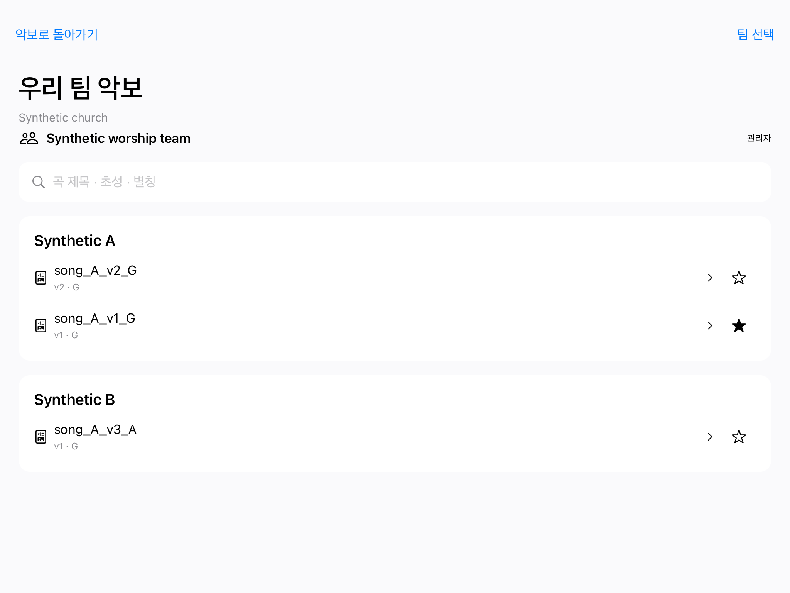
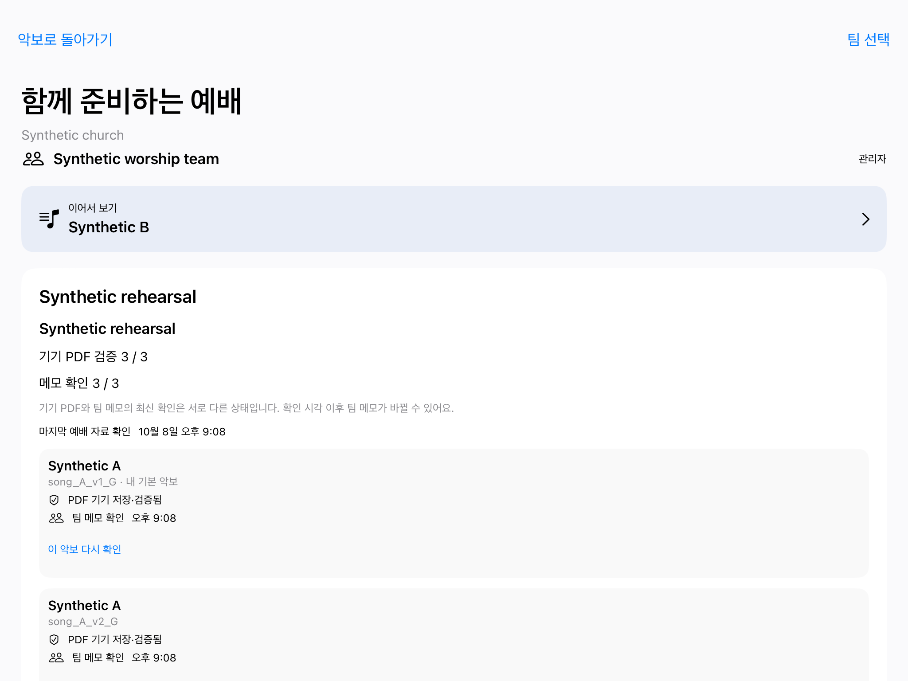

# WorshipCue

**악보와 필기는 각자 편하게. 곡 안내와 팀 필기는 함께.**

한국어 찬양팀을 위한 iPad 네이티브 악보장입니다. 익숙한 PDF 악보 위에 개인 메모를 남기고, 팀의 수정 사항과 다음 곡 안내를 연주 흐름 안에서 확인할 수 있도록 개발하고 있습니다.

[English](README.md) · [Build 8 검증 결과](verification/BUILD8.md) · [개발 계획](docs/12_BUILD_PLAN.md)

기존 화면은 **v1 / Build 3**로 보존했습니다. **v2 / Build 8**에서는 디자인 콘셉트에 맞춘 화면과 AWS 팀 공간을 이어가며, 팀·채팅 바로가기, 개인·팀 악보 전환, 곡별 준비 확인·재시도, 화면 폭에 맞는 곡 안내와 파일을 포함한 개인 클라우드 ZIP 내보내기를 제공합니다. `main`은 v1 체크포인트를 유지합니다. 앱 개발 버전과 PDF 악보 버전 번호는 서로 다르며, App Store 출시를 뜻하지 않습니다.

## 왜 만들고 있나요?

찬양팀이 준비하는 것은 PDF 한 장만이 아닙니다. 브리지 반복 횟수, 보컬 진입, 건반 보이싱, 쉬어야 할 마디처럼 리허설에서 적은 메모가 함께 쌓입니다. 새 편곡 악보가 왔다고 이전 메모를 잃거나 처음부터 다시 옮겨 적고 싶지는 않습니다.

예배 중 예정에 없던 곡으로 넘어갈 때도 마찬가지입니다. 밴드마스터는 곡과 키를 분명하게 전달해야 하고, 연주자는 지금 보고 있는 마디를 마친 뒤 자기 타이밍에 다음 악보를 열 수 있어야 합니다.

WorshipCue는 **내가 준비한 악보와 필기를 지키면서 팀의 변화도 놓치지 않는 경험**을 목표로 합니다. iPad에서 PDF로 리허설하는 연주자와 보컬, 특히 건반을 연주하며 팀을 이끄는 밴드마스터가 첫 사용자입니다.

## 리허설에서 어떤 도움이 되나요?

| 이런 순간에 | 제공하려는 경험 | 현재 상태 |
|---|---|---|
| 새 악보가 왔는데 이전 필기가 필요해요. | 원본과 필기를 남겨 두고 필요한 획만 선택해 새 악보에 옮깁니다. | 불변 PDF 가져오기, 버전·페이지별 저장, 수동 선택 복사/붙여넣기 구현. 한국어 검색과 명시적 기본 악보 선택 구현. |
| 진입 마디를 빠르게 표시하고 싶어요. | 펜·형광펜으로 쓰고 작은 팝업에서 색상을 고릅니다. | 구현. 손가락 필기와 색상 변경은 실제 iPad에서 검증. Apple Pencil 실물 검증은 남아 있음. |
| 리허설 중 인터넷이 끊겼어요. | 기기에 있는 악보를 계속 읽고 개인 메모를 로컬에 저장합니다. | 로컬 읽기·저장·복구 검증. 팀 자료 다운로드와 계정별 오프라인 보관 구현. 실제 서비스의 네트워크 복구 검증은 남아 있음. |
| 밴드마스터가 후렴에 동그라미를 쳤어요. | 정확히 같은 악보에는 팀 필기를 보고, 다른 버전이면 팀 악보를 미리봅니다. | 정확한 항목·버전·페이지의 공유 필기와 명시적 게시 구현. 네이티브 어댑터·SQL 권한 검사 통과. 실제 두 iPad 공유 검증은 남아 있음. |
| 예정에 없던 곡으로 넘어가요. | 조용한 화면 안내로 곡·키를 확인하고 직접 눌러 악보를 엽니다. | 최신 안내·직접 열기·별도 기록·진행 권한 구현. 실제 AWS 순서·WebSocket·복구 검사 통과. 두 iPad 리허설 검증은 남아 있음. |
| 이번 예배 편곡 이야기를 어디서 했나요? | 팀·예배 목록별로 대화하고, 메시지에 답장하거나 연결된 악보를 직접 미리봅니다. | 안 읽은 대화·알림 끄기, 수정·삭제·고정, 답장·원문 이동, 악보 링크, 신고·차단·해제와 리더의 신고 처리 구현. 실제 AWS 검사 통과; 최신 기기 결과는 별도 기록. |

## 지금 사용할 수 있는 기능

현재 v2 앱은 **로컬 예배 준비와 비공개 팀 기능을 구현한 Build 8 네이티브 개발 빌드**입니다. 로컬 기능은 서버 없이 사용할 수 있습니다. 사용자가 선택한 AWS 개발 서버를 배포했으며, 교회 안의 팀마다 악보·예배 목록·채팅을 분리합니다. 밝은 악보대와 세로 필기 도구, 버전·메모 패널을 제공합니다. 최신 네이티브 검사와 실제 서버 검사 결과는 [Build 8 기록](verification/BUILD8.md)에서 구분합니다. App Store 출시 버전이나 리허설 운영 검증이 끝난 파일럿은 아닙니다.

- **PDF 읽기와 가져오기:** 파일 앱에서 가져온 PDF를 검증해 앱 내부에 보관합니다. 가져오기 실패가 현재 읽고 있는 악보를 바꾸지 않습니다.
- **주간 예배 준비:** 예정곡과 대기곡을 담은 목록을 만들고, 곡마다 사용할 악보 버전과 연주 키를 정합니다. 같은 곡을 여러 순서에 넣고 목록을 복사할 수 있습니다.
- **곡별 준비 상태 확인:** 검증된 기기 PDF와 마지막 팀·개인 메모 확인을 따로 표시하고, 한 곡만 다시 확인할 수 있습니다. 준비 목록에서 직접 연 악보에는 해당 순서의 연주 키와 정확한 팀 필기를 사용하며, 곡 안내를 확인한 것으로 처리하지 않습니다.
- **한국어 라이브러리:** 제목·초성·별칭·찬송가 번호 검색과 즐겨찾기. 악보 열기와 개인 기본 악보 지정은 별도 동작입니다.
- **주간 PDF 나누기와 내보내기:** 시작·끝 페이지를 직접 지정해 곡별 PDF를 만들고, 원본·편곡자 메모와 선택한 개인 필기로 새 PDF를 내보냅니다.
- **개인 필기:** 펜, 형광펜, 획 지우개, 실행 취소, 다시 실행. Apple Pencil 연결 구조가 구현되어 있으며, 화면의 **손가락 필기** 모드로 터치 필기를 사용할 수 있습니다.
- **작은 색상 팝업:** 도구 옆 색상 원을 누르면 8개 색상이 나타납니다. 색상 선택, ×, 팝업 바깥 탭으로 닫을 수 있습니다. 펜과 형광펜은 각자 선택한 색상을 기억합니다.
- **정확한 악보에 저장:** 개인 메모는 버전과 페이지에 연결됩니다. ‘기기에 저장됨’은 실제 로컬 데이터베이스 저장 이후 표시합니다.
- **선택한 필기만 이동:** 사각형으로 선택 → 복사 → 대상 악보·페이지 선택 → 붙여넣기 미리보기 위치·크기 조정 → 확정 또는 취소. 원본 메모는 그대로 남습니다.
- **내 페이지 유지:** 페이지는 각자 넘깁니다. 앱을 다시 열면 로컬 악보·페이지와 저장된 필기를 복구합니다.
- **비공개 팀 공간:** 관리형 이메일 인증, 예배 하나로 제한한 게스트 초대, 버전별 팀 악보·목록과 검증된 다운로드를 구현했습니다. 계정별 기기 저장소를 분리하고 개인 메모 충돌은 두 사본을 직접 비교·선택합니다.
- **팀·채팅 바로가기:** 개인 보관함과 선택한 팀 보관함을 직접 전환하고, 현재 교회·팀을 확인한 뒤 대화방으로 이동할 수 있습니다. 팀을 바꾸어도 다른 팀의 자료를 섞지 않습니다.
- **팀 구성원과 초대 관리:** 내 표시 이름과 구성원 목록을 확인합니다. 팀 관리자는 초대를 취소하고 역할·참여 상태를 변경하거나 관리자 권한을 넘길 수 있습니다. 동시 변경에서도 마지막 관리자를 남깁니다.
- **안전한 게시 재시도:** PDF·예배 목록의 내용과 작업 식별자를 전송 전에 저장합니다. 응답이 불확실하면 같은 작업을 직접 재시도합니다. 큰 팀 보관함은 나누어 불러오고 전체 검증이 끝난 뒤 읽을 수 있는 기존 저장본을 교체합니다.
- **내 클라우드 메모 가져가기:** 선택한 팀의 내 기록, 검증된 PencilKit 필기·미리보기 파일과 메모 해석에 필요한 접근 가능한 원본 PDF를 ZIP으로 저장하거나 공유합니다. 목록에는 정확한 버전·페이지·좌표 정보와 파일 검증값을 담습니다. 기기에서 아직 동기화하지 않은 메모, 초안, 다른 팀과 공유 팀 필기는 제외합니다. 전체 계정 백업이나 자동 복원 기능은 아닙니다. 계정 사전 점검은 관리자 인계 필요 여부를 알려 주며, 계정 삭제는 아직 제공하지 않습니다.
- **예배 준비 대화:** 팀 또는 예배 목록의 대화방을 고르고 안 읽은 메시지를 확인하거나 알림을 끕니다. 답장·원문 이동, 작은 수정·삭제·고정 메뉴를 제공합니다. 초안과 작업은 기기에 저장한 뒤 직접 전송·재시도하며, 채팅 수신이 악보나 페이지를 바꾸지 않습니다.
- **정확한 악보 링크:** 접근 권한이 있는 게시된 악보만 연결합니다. 미리보기와 열기는 직접 선택하며, 링크가 새로운 자료 권한을 주거나 곡 안내 확인을 대신하지 않습니다.
- **팀 안에서 신고 처리:** 메시지 신고, 작성자 차단·해제, 리더의 신고 해결·기각을 제공합니다. 삭제·차단된 본문과 악보 링크는 복구나 예전 작업 재시도에서도 숨깁니다. 확인 범위를 넘어 정확한 안 읽은 개수를 알 수 없으면 ‘새 대화’로 표시하고 임의 숫자를 만들지 않습니다.
- **명시적인 팀 필기 공유:** 진행 권한을 가진 한 기기가 기기 초안을 저장하고 직접 게시합니다. 같은 순서 항목·버전·페이지에만 읽기 전용으로 표시하며, 다른 버전은 별도 팀 악보 미리보기를 제공합니다. 오프라인 초안은 자동 게시하지 않습니다.
- **조용한 곡·키 안내:** 화면 폭에 맞는 작은 안내 영역에 최신 곡만 표시하고 최근 기록은 별도로 봅니다. 연주자가 탭한 뒤 검증된 기본 악보 또는 직접 선택한 버전을 엽니다. 수신·재연결·예배 종료가 현재 악보를 바꾸지 않습니다.

실제 AWS에서는 계정·팀 권한, 변경할 수 없는 PDF 업로드, 개인 메모 충돌, 채팅 대화방·읽음·운영·차단 복구와 WebSocket 안내를 검사했습니다. [Build 8 기록](verification/BUILD8.md)은 제어된 네이티브 검사와 실제 서버 검사를 구분하며, 실제 두 iPad 동작은 아직 검증하지 않았습니다. 현재 AWS 개발 환경의 이메일 로그인은 검증된 수신자만 사용할 수 있습니다. 서버 미설정 빌드는 로컬 기능을 계속 제공합니다.

### 실제 Build 8 화면

아래는 실제 iPad의 앱이 네이티브 테스트 중 그린 팀 보관함·준비 목록·작은 곡 안내입니다. 합성 악보, 분리된 저장소와 제어된 HTTP 응답을 사용했습니다. 디자인 시안이나 일반 개인 작업 공간의 전체 화면이 아니며, 실제 계정으로 두 iPad가 공유한 증거도 아닙니다.

  
  
  

[이전 실제 앱 화면](README.md#historical-build-5-captures)은 당시 Build 5의 합성 악보와 분리된 테스트 저장소에서 촬영했습니다. [UI 시안](docs/ui-concepts/README.md)은 v2 화면의 디자인 방향입니다.

## 연주자의 타이밍을 지킵니다

- 곡 안내를 받거나 재연결되어도 열어 둔 악보는 유지합니다. 다음 곡은 연주자가 직접 눌러 엽니다.
- 페이지 동기화는 제공하지 않습니다.
- PDF 버전은 불변 원본으로 남깁니다. 필기 자동 병합이나 임의 좌표 맞추기는 하지 않습니다.
- 개인 필기와 팀 필기는 별도 레이어입니다. 팀 필기는 해당 순서 항목·정확한 버전·페이지가 일치할 때만 겹쳐 표시합니다.
- 키 이름을 바꿨다고 PDF 코드나 음표가 조옮김되는 것은 아닙니다.

기존 로컬 악보·필기와 식별자는 보존합니다. 팀 자료는 서버·계정·교회·팀별 보호 저장소와 기기 전용 Keychain 인증으로 분리합니다. 실제 AWS 권한 검사에서도 다른 팀의 자료와 다른 사람의 개인 메모 접근을 거부했습니다. 교회 관리자 역할만으로 다른 팀의 자료를 볼 수 없습니다.

## 다음 단계

승인받은 PDF 파서와 일일 데이터·파일 백업을 AWS 개발 서버에 적용했습니다. 실제 이메일 코드 인증·갱신·로그아웃이 통과했습니다. SES 영구 반송·스팸 신고는 지정된 계정·발송 설정·주제 범위 안에서 처리하며, 주소 원문 대신 SHA-256 해시로 추가 코드 발송을 차단합니다. 비공개 실패 복구 큐를 두었고, 운영자 알림 구독 확인과 지정 CloudWatch 경보 전달 경로 검사를 통과했습니다. 메일 경보 4개와 백업 실패·완료 지연 경보 2개를 배포했으며, 최신 확인에서 6개 모두 정상 상태였습니다. 이전 Build 7 수동 백업에서는 버전 고정 파일 7개를 검증하고 데이터베이스 백업과 완료 목록을 만들었습니다. 분리된 복원 검사에서 행 756개를 복원하고 안정된 행 661개가 정확히 일치함을 확인했습니다. 파일 7개·게시 참조 7개·불변 행 13개를 검증한 뒤 검사 전용 테이블만 제거했습니다. 작은 보관함의 한 번 백업 실행 결과이며, 여러 실행에 걸친 실제 복구는 아직 확인하지 않았습니다. 검사 소유 백업 오류 경보의 SNS 전달과 정상 상태 자동 복귀는 확인했지만, 운영자 이메일 수신과 완료 지연 경보 자체의 전달은 아직 확인하지 않았습니다.

SES 운영 발송 신청은 현재 **DENIED(거절)** 상태입니다. 사용자가 AWS Support의 요청에 따라 추가 사용 설명을 제출했고, 사례 상태는 **Customer action completed**로 바뀌었습니다. 그러나 10월 8일 22:21 EDT 최신 계정 재조회에서도 운영 발송은 비활성화되고 샌드박스 제한이 유지되어, 검증되지 않은 교회 구성원에게는 코드를 보낼 수 없습니다. 두 실제 iPad 공유, 원래 iPadOS 16 기기, Apple Pencil 실물, 네트워크·백그라운드 복구, 파일 크기·동시 사용 부하와 장시간 리허설 검증은 남아 있습니다. 파일을 포함한 개인 클라우드 ZIP은 구현했지만 전체 계정 백업·자동 복원·계정 삭제와 승인된 보관 정책·운영 대응 절차는 제공하지 않습니다. [Build 8 검증 기록](verification/BUILD8.md) · [SES 후속 설명](verification/SES-support-followup.md) · [마일스톤 계획](docs/12_BUILD_PLAN.md). 앱 결제, 푸시, TestFlight와 공개 배포는 활성화하지 않았으며, AWS 개발 자원에는 사용량 요금이 발생합니다.

## 이해관계자에게 공유할 인프라 그림

[한 페이지 PDF](output/pdf/worshipcue-infrastructure.pdf), [발표용 이미지](docs/architecture/worshipcue-infrastructure.png), [수정 가능한 벡터 그림](docs/architecture/worshipcue-infrastructure.svg)을 제공합니다. [구조 설명](docs/architecture/README.md)에서 오프라인 사용, 팀별 분리, 로그인, 채팅·실시간 안내, 백업과 남은 출시 조건을 확인할 수 있습니다.

## 개발 및 검증

최소 배포 대상은 **iPadOS 16.0**입니다. 현재 실제 테스트 기기는 **iPad 6세대, iPadOS 17.7.11**이며, 기존 16.7.16 iPad와 Apple Pencil 실물 검증은 아직 남아 있습니다.

### 최신 Build 8 결과

- 실제 iPad 네이티브 검사 **전체 107개: 106개 통과, 실패 0개, 비공개 입력 없는 선택 검사 1개 건너뜀**. 제어된 통신으로 준비 항목·팀 필기 연결, 곡별 준비 상태·실패 복구와 선택 팀의 개인 파일 ZIP을 검사했습니다.
- 사용자 PDF를 별도로 제공한 기기 검사 **1개 중 1개 통과**, 두 4페이지 편곡의 새 PDFKit 렌더 8개 확인. 원본과 비공개 캡처는 Git에 포함하지 않습니다.
- 추가 화면 폭 대응 곡 안내 검사 **1개 중 1개 통과**. Release 빌드와 번들 설정 검사 통과. 설치된 앱의 **Build 8 / 0.0.1** 정보와 일반 실행 수락을 확인했지만, 최종 일반 작업 공간 전체 화면은 촬영하지 못했습니다.
- 핵심 규칙 **55개**, Python 참조 **32개**, 로컬 저장소 **14개**, 필기 확인 **9개 그룹 통과**, 모두 종료 코드 0.
- AWS 제어 검사 **190개 중 190개**, 원격 통신 검사 **31개 중 31개**, 실제 서버 시나리오 **27개 중 27개**, 서버 작업 공간 시나리오 **4개 중 4개 통과**. 제어된 앱 검사와 실제 서버 결과는 서로 다른 증거입니다.
- 기존 **PDF 7개와 개인 필기 기록 3개 전체가 정확히 보존**되었습니다. 별도 터치 실행기는 **종료 코드 65, 실제 실행한 작업 흐름 0개**로 최신 터치 검증을 완료하지 못했습니다.
- 동시 50개 요청 검사는 **48개 통과·2개 실패**로 부하 검증에 실패했습니다. 따로 속도를 나눈 비교는 **50개 중 50개 통과**했지만 실제 동시 사용을 검증한 결과는 아닙니다. 계정의 공유 Lambda 동시 실행 한도는 **10개**로 유지했습니다.

상세 결과와 남은 조건은 [Build 8 기록](verification/BUILD8.md)에 있습니다. 이 통과 기록은 실제 두 iPad 리허설이나 출시 준비 완료를 뜻하지 않습니다.

### 이전 검증 기록

Build 5 실제 iPad 네이티브 검사에서 **34개 통과, 실패 0개, 비공개 입력 없이 실행한 1개 건너뜀**을 기록했습니다. 기존 로컬 회귀 검사와 제어된 HTTP로 실행한 팀 어댑터 검사 15개를 포함합니다. 추가 검토 회귀 및 화면 검사 결과는 [당시 기록](verification/M2-M4-native.md)에 따로 보존합니다. 팀 설정·재실행 복구와 로컬 주간 준비 UI 검사 2개가 각각 통과했습니다. 추가 화면 검사는 XCTest 실행 앱의 Screen Time 제한 때문에 미확인으로 남았으며, 정확한 타임아웃·부분 결과를 당시 기록에 보존합니다.

Build 7에서 별도로 실행한 실제 편곡 PDF 네이티브 검사 **1개 통과**: 두 4페이지 PDF의 PDFKit 페이지 렌더 8개와 편곡자 주석, 수동 메모 복사, 재실행 복구, 내보내기 렌더 비교를 확인했습니다. 원본과 캡처는 외장 드라이브에만 보관합니다. [비공개 악보 테스트](docs/PRIVATE_PDF_TESTING.md)

이전 핵심 규칙 55개, Python 참조 검사 32개, 로컬 저장소 14개와 필기 9개 그룹이 통과했습니다. 당시 원격 통신 검사는 24개 통과했으며, [Build 7 기록](verification/CHAT7.md)에 보존합니다. Build 7 AWS 단위·경계 검사는 **185개 통과, 실패 0개**이며 도메인 검사 76개를 포함합니다. 당시 배포한 실제 서버 기능 시나리오는 **27개 통과, 실패 0개**이며 이름·팀 관리, 구성원·게스트 보관함 나누어 불러오기와 내 기록 내보내기를 포함합니다. 작은 보관함의 백업·분리 복원은 통과했지만, 여러 실행에 걸친 백업 복구와 전체 사용 흐름의 동시 부하 검증은 완료하지 않았습니다.

이전 Build 7에서 보관함 첫 페이지만 동시에 읽는 검사 **20개 중 20개 통과**를 기록했습니다. 40번 요청 중 일시적 HTTP 503 재시도가 20번 있었으며 전체 2.047초, p95 1.994초였습니다. **50개 검사는 48개 통과·재시도 소진 2개로 실패**했습니다. 135번 요청에서 HTTP 429 14번·HTTP 503 73번, 전체 5.921초를 기록했습니다. 두 합성 계정과 클라이언트당 첫 페이지 한 번 읽기만 검사했고, 공유 Lambda 동시 실행 한도 10개를 사용했습니다. 실제 20명·50명의 전체 사용 흐름을 검증한 결과는 아닙니다.

이전 Build 7 실제 iPadOS 17.7.11 네이티브 실행은 **86개 중 85개 통과, 선택적 비공개 PDF 검사 1개 건너뜀, 실패 0개**였습니다. 팀 공간 46개·팀 관리 10개·기록 내보내기 10개·필기 20개를 실행했습니다. Release·일반 기기 Debug 빌드와 번들 검사 9개도 통과했습니다. 별도 터치 UI 검사 11개는 자동화 연결 타임아웃으로 아무 검사도 실행하지 못했습니다. 테스트 실행 옵션 없이 Build 7을 열어 기존 PDF 7개와 필기 파일 3개의 보존을 확인했습니다.

이전 Build 6의 AWS 검사 101개·실제 서버 시나리오 17개와 Release·테스트용 빌드 통과 기록은 [기존 AWS 기록](verification/AWS.md)에 보존합니다. 그때의 백업 복원에서 151개 행을 복원하고 안정된 134개 행과 파일 6개의 내용을 확인했습니다. Build 5·Build 6의 통과 기록을 최신 빌드 기기 통과로 해석하지 않습니다.

이전 Supabase 검사인 PostgreSQL 통합 13개 그룹과 Deno 핸들러 7개는 그대로 보존합니다. 인증·저장소 스키마 대역과 제어된 HTTP를 사용했으며 실제 Supabase 배포나 두 기기 실시간 검증을 뜻하지 않습니다.

[English README의 개발 명령](README.md#development), [네이티브 실행 안내](apps/ipad/README.md), [최신 검증 기록](verification/BUILD8.md)을 확인해 주세요. 개발에 착수할 때는 [AGENTS.md](AGENTS.md), [확정 결정](docs/02_DECISIONS.md), [프로젝트 상태](PROJECT_STATE.md)를 먼저 읽습니다.

저장소에는 상업 찬양곡 대신 합성 테스트 악보만 포함합니다. 실제 악보를 가져오거나 공유할 권한은 별도로 확보해야 합니다. WorshipCue 자체 소스에 오픈소스 라이선스를 부여한 상태는 아니며, 외부 의존성 고지는 [ThirdPartyNotices](apps/ipad/WorshipCue/ThirdPartyNotices.txt)에 있습니다.

## 로컬 예배 준비 기능 (M1)

오늘 · 라이브러리에서 곡 제목·초성·별칭·찬송가 번호로 검색하고 즐겨찾기를 지정할 수 있습니다. 예배 목록에 예정곡과 대기곡을 담고, 반복되는 곡도 각각 다른 순서로 저장합니다. 악보 버전과 연주 키를 정하고 목록을 복사하거나 순서를 바꿀 수 있습니다.

새 PDF는 기존 악보를 바꾸지 않고 다음 버전으로 저장합니다. 개인 기본 악보는 별도로 지정하며, 다른 악보를 여는 것만으로 바뀌지 않습니다. 주간 PDF는 곡별 페이지 범위를 직접 정해 나눕니다. 원본과 편곡자 메모를 보존하고, 개인 필기는 선택·미리보기·확정 과정을 통해서만 복사합니다.

오프라인 파일 확인은 선택 악보·개인 기본 악보·대기곡을 검사합니다. 원본 PDF와 선택한 개인 메모로 새 PDF를 만들어 공유하거나 파일 앱에 저장할 수 있습니다. 당시 로컬 기능의 결과는 [M1 기록](verification/M1.md)에 보존합니다. 최신 팀 기능의 통과 검사와 실제 여러 iPad·기기 검증 조건은 [Build 8 기록](verification/BUILD8.md)에서 확인할 수 있습니다.
