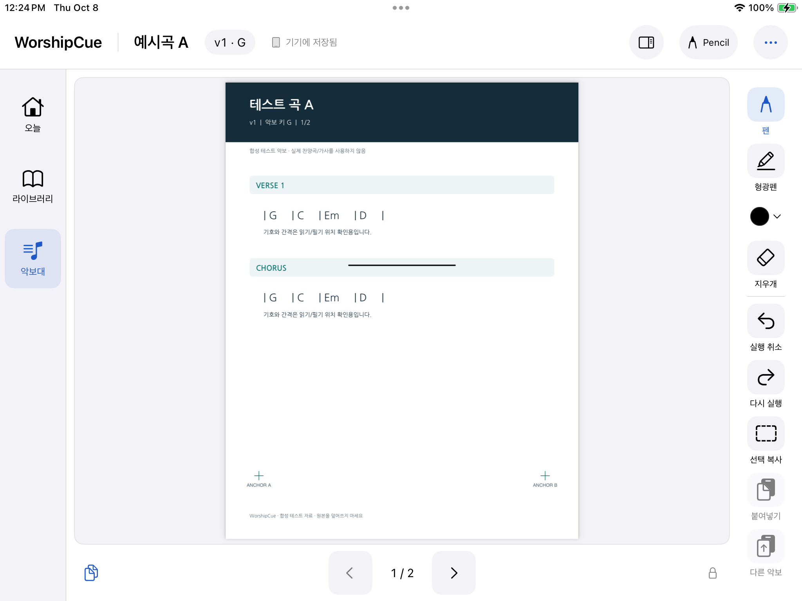
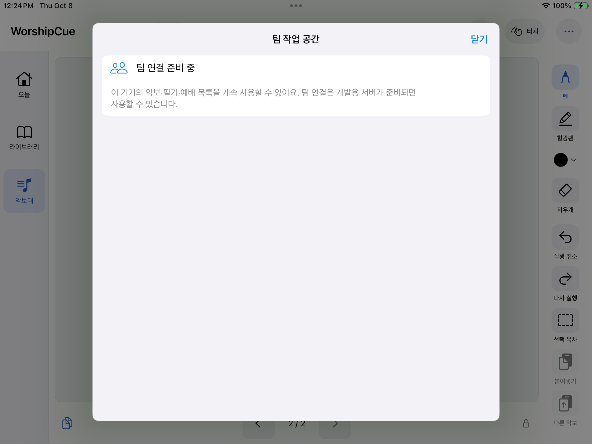

<p align="center">
  
</p>

<h1 align="center">WorshipCue</h1>
<p align="center"><strong>Your charts. Your notes. Your cue.</strong></p>
<p align="center">A Korean-first native iPad music stand for worship teams.</p>
<p align="center">악보와 필기는 각자 편하게. 곡 안내와 팀 필기는 함께.</p>
<p align="center"><a href="README.ko.md">한국어 소개</a> · <a href="#working-today">Working today</a> · <a href="#development">Development</a> · <a href="verification/AWS.md">Test evidence</a></p>

**Development versions:** [v1](https://github.com/manynames3/WorshipCue/tree/v1) preserves the original working interface (Build 3). [v2](https://github.com/manynames3/WorshipCue/tree/v2) develops the concept-based interface and AWS team workspace (Build 6). `main` stays at v1 while v2 is being qualified. These are development checkpoints, not App Store releases.

## Why WorshipCue exists

Worship musicians prepare more than a PDF. They mark the bridge, circle an entrance, write a voicing, and remember which arrangement they rehearsed. When a revised chart arrives, that work should remain easy to find. When a leader calls an unplanned song, musicians need a clear cue and a moment to choose when to open it.

WorshipCue is being built around those moments: **keep the chart you trust, preserve the notes you made, and stay aware of the team's next move.**

It is for musicians and singers who already rehearse from PDF charts on iPad, and for bandmasters—often leading from the keyboard—who need to communicate changes while performing. The first interface is Korean; the underlying implementation is native Swift, PDFKit and PencilKit.

## What this means in rehearsal

| The moment | The experience WorshipCue is built to provide | Current status |
|---|---|---|
| “The updated arrangement arrived. Where are my notes?” | Keep the original PDF and its notes; select only the markings you want to carry into the new chart. | Immutable imports, version/page-specific ink and manual selected-note transfer implemented. Local library metadata, Korean search and explicit version/preference controls are implemented. |
| “I need to mark this entrance quickly.” | Write or highlight directly on the chart, switch colors in a small popover, and undo without touching the team layer. | Implemented; finger drawing, color selection and recovery tested on a real iPad. Physical Apple Pencil qualification remains open. |
| “We lost Wi-Fi during rehearsal.” | Continue reading local charts and saving personal notes on the device. | Local reading/save/restore tested. Team preflight and account-scoped offline caches are implemented; real service recovery still needs qualification. |
| “The bandmaster circled the second chorus.” | See team handwriting on the exact matching chart, with your personal notes kept separate. | Exact-context shared drawing, draft publication and private backend permissions implemented. Native adapter and database tests pass; real multi-iPad sync remains unverified. |
| “We're moving to an unplanned song.” | See a quiet song/key cue and tap when you are ready to open it; keep control of your page. | Visual latest-cue, tap-to-open, history and controller fencing implemented. Real AWS sequencing, WebSocket hints and catch-up pass; multi-iPad rehearsal remains unverified. |
| “Where did we discuss Sunday's arrangement?” | Keep preparation chat with the team or setlist, separate from other teams. | Durable AWS chat and a Korean native panel implemented; explicit draft retries and server catch-up tested. Native moderation controls remain unfinished. |

## Working today

The v2 branch is a **native music stand with local preparation and an AWS team workspace**. Earlier local workflows were tested on a real iPad; Build 6 compiles and its AWS service passes hosted checks. Local use works without a server. Each team's library, setlists and chat are separate. It is not an App Store release or a qualified rehearsal pilot. [Current AWS evidence](verification/AWS.md), [earlier native evidence](verification/M2-M4-native.md) and [v2 design history](verification/V2.md) distinguish implemented behavior from service and hardware gates.

- **Give the music room to breathe.** A light reader, compact song/version/key header, vertical annotation tools and local page controls keep the PDF central. Today, Library and Stand remain within reach.
- **Read PDFs on iPad.** Import from Files into validated, app-owned immutable assets; an import failure preserves the chart already open.
- **Prepare a weekly set.** Create, reorder and clone local setlists with separate standby songs; choose an exact chart version and performance key for each occurrence.
- **Find the chart you rehearsed.** Korean title/initial/alias/hymn-number search, favorites, immutable numbered versions and an explicitly selected personal preferred chart. Opening another chart does not change your preference.
- **Split a weekly PDF deliberately.** Choose inclusive page ranges and song/version metadata. Derived PDFs preserve embedded arranger annotations; the original packet and its notes stay intact.
- **Export a fallback.** Create a new PDF with source/arranger content and optionally your personal ink, then share or save it through the native share sheet.
- **Make personal notes.** Pen, highlighter, stroke eraser, undo and redo. Apple Pencil integration is implemented; the visible **손가락 필기** mode supports tested finger drawing.
- **Change colors quickly.** Eight named colors in one compact popover. Pen and highlighter remember separate choices. Select a color, tap ×, or tap outside to close it.
- **Keep notes attached to the right chart.** Ink is stored against the exact version and page. Local save status follows a database commit, with recovery and save-failure handling.
- **Move selected notes deliberately.** The charcoal version/notes panel shows real chart thumbnails and your selected source ink beside the page in landscape. Select strokes, copy, choose a destination, drag/scale the paste preview, then confirm or cancel. A pinned source-preservation lock explains that original notes stay intact; a committed paste can be undone. Narrow layouts use a dismissible sheet.
- **Keep your own place.** Page turns are local. The reader remembers its chart/page and restores locally saved notes after reopening.
- **Connect a private team.** Managed email sign-in, scoped guest invitations, a shared versioned library and setlists, verified downloads, account-separated personal sync with explicit whole-copy conflict choices, and owner-only server access are implemented. The current AWS development environment requires verified email recipients.
- **Keep rehearsal conversations together.** Team and setlist chat have cached history, durable drafts and explicit send/retry. Incoming chat leaves your chart and page in place.
- **Share rehearsal markings deliberately.** One editor holds a fenced lease. Team drafts save locally and publish only on an explicit action. Matching item/version/page ink is read-only for musicians; another chart version opens a separate preview. Offline drafts never publish themselves.
- **Receive a cue without losing your place.** A visual banner shows only the latest pending song/key; history is separate. Tapping opens a verified chart using your preferred version or an explicit alternative. Opening telemetry means rendered, not ready. Reconnecting and session end preserve the reader.

Real AWS checks qualify managed authentication, private file transfers, exact-team permissions, durable chat and foreground WebSocket hints. Build 6's native tests compile; its device execution remains open. An unconfigured app says **팀 연결 준비 중** and keeps local rehearsal available.

### Actual app screens

These earlier Build 5 captures come from a passing physical iPad UI workflow using synthetic charts and an isolated store. The reader shows a recovered personal stroke; the team panel reflects the then-unconfigured service. They are real app captures, not concepts or proof of hosted sharing.

<p align="center">
  
  
</p>

Historical color captures remain in [Build 2 evidence](verification/M0-colors-icon.md). [Build 5 device evidence](verification/M2-M4-native.md) and [Build 6 AWS evidence](verification/AWS.md) retain their separate scopes.

The [UI concepts](docs/ui-concepts/README.md) guide the v2 reader, manual-transfer panel and quiet visual cue. Team UI uses actual managed-service operations when configured; concepts and historical captures are not proof of a running service.

## The musician stays in control

These are fixed product decisions, not optional follow modes:

- **You choose when a song opens.** Planned announcements require a tap; receiving a cue or reconnecting must preserve the currently open chart.
- **You turn your own pages.** There is no page synchronization.
- **Your notes belong to the paper you marked.** Published charts are immutable. Transfer is manual; there is no automatic note merging or guessed alignment.
- **Personal and team notes have separate layers.** Shared ink must match the exact performance item, chart version and page. Other versions require a preview rather than an overlay.
- **A key label is information.** Changing metadata does not transpose PDF chords or notation.

The local reader retains its existing identities and files. The AWS workspace uses separate protected server/account/church/team stores and device-only Keychain credentials. Exact-team authorization denies access across teams, and leaders/admins cannot read another owner's personal ink. The earlier Supabase implementation is preserved.

## Team activation and remaining qualification

The user-selected [AWS development backend](aws/README.md) is deployed with managed sign-in, private immutable PDFs, isolated team libraries/setlists, note revision checks, visual cues and durable team chat. The native chat panel preserves drafts and retries explicitly. The approved PDF parser verifies uploaded files before publication; daily backups cover metadata and files. See [exact AWS evidence](verification/AWS.md) and [native configuration](apps/ipad/README.md#private-team-configuration-build-6). Public endpoints are configured locally through ignored `Secrets.xcconfig`; AWS credentials never enter the app.

Real hosted checks cover email-code verification and refresh/sign-out, team/guest boundaries, immutable PDF transfers, private-note conflicts, durable chat and WebSocket hints. SES access for unverified recipients, two real iPads sharing marks/cues/chat, original iPadOS 16 hardware, physical Apple Pencil and a two-hour rehearsal remain gates. Chat moderation controls and account export/deletion are unfinished. [The milestone plan](docs/12_BUILD_PLAN.md) remains authoritative. App billing, background push, TestFlight and public distribution are disabled; the AWS development resources incur usage charges.

## Development

### Run the native app

The deployment target is **iPadOS 16.0**. The currently tested physical device is an **iPad (6th generation), iPadOS 17.7.11**. The original 16.7.16 iPad and physical Apple Pencil still need qualification.

Use macOS with an iOS SDK and a Swift 6.1+ toolchain. Current successful Debug/device and Release build evidence uses Xcode 27.0. GRDB is pinned to 7.11.1. The latest Xcode 26.6 asset build is blocked by an absent simulator runtime; see the exact test record.

```sh
git clone https://github.com/manynames3/WorshipCue.git
cd WorshipCue
git switch v2
open apps/ipad/WorshipCue.xcodeproj
```

Choose scheme **WorshipCue** and your available iPad or installed simulator. Configure your own development signing locally for device runs. The current local device setup uses a free Personal Team; no paid enrollment was purchased. Keep signing identities and device identifiers out of commits.

See [native setup and test commands](apps/ipad/README.md). The existing [external-drive toolchain setup](docs/13_EXTERNAL_XCODE_SETUP.md) is optional; scripts support `WORSHIPCUE_XCODE_APP` and `WORSHIPCUE_TOOLS_ROOT` overrides for a different local layout.

### Check the reference contracts and local storage

With Xcode's developer tools selected:

```sh
swift test --package-path reference/WorshipCueCore
swift test --package-path packages/WorshipCueLocal
swift run --package-path packages/WorshipCueLocal InkChecks
swift test --package-path packages/WorshipCueRemote

python3 -m venv .venv
.venv/bin/python3 -m pip install -r scripts/requirements.txt
.venv/bin/python3 scripts/verify_package.py
python3 scripts/verify_m0_project.py
python3 scripts/test_backend.py
deno test --config supabase/deno.json supabase/tests/edge_test.ts
```

Scheme **WorshipCue** contains hosted native tests; **WorshipCueUI** also contains device UI workflows. Tests use isolated stores and synthetic PDFs. The real-device script accepts privately supplied signing/device environment variables; it does not hard-code credentials.

### Verification status · 2026-10-08

| Evidence | Recorded result |
|---|---|
| Build 5 physical native suite | **34 passed, 0 failed, 1 private-input skip**, total 35, iPadOS 17.7.11. Includes local regressions and 15 managed-workspace adapter cases using controlled HTTP responses. Includes reviewed regressions for active-stroke protection, exact shared context and offline previews. |
| Actual private PDFs | **1 current native case passed** with both supplied four-page arrangements: preserved arranger annotations, manual transfer, recovery and fallback render comparison. PDFs and captures stay outside Git. |
| Visible team setup | **2 current UI workflows passed individually**: local preparation and team-setup/chart/page/ink/cold recovery. Other selected checks remain unverified; a Screen Time limit on the test runner was diagnosed. |
| Portable packages | **55 core, 32 Python reference, 14 local storage and 24 remote transport tests passed; 9 ink check groups passed.** |
| AWS backend | **101 unit/boundary tests and 17 real hosted scenarios passed, zero failures.** Real email-code verify, protected access, refresh and sign-out passed separately. |
| AWS backup/restore | **151 rows restored; 134 stable rows matched exactly; six version-pinned file copies verified.** Isolated restore table deleted after qualification. |
| Preserved Supabase backend | Earlier **13 PostgreSQL groups and 7 Deno tests passed** using local schema/HTTP test shims; this is not a managed Supabase deployment. |
| Build 6 native builds | Xcode 27 generic-device Release and Debug **build-for-testing passed**, minimum iPadOS 16.0. Native/UI tests compiled; none executed on a device for Build 6. |
| Remaining gates | SES access for unverified recipients, multi-iPad use, original iPadOS 16 device, physical Apple Pencil, memory/thermal/resume and rehearsal soak **not verified**. |

See [current AWS evidence](verification/AWS.md), [Build 5 native evidence](verification/M2-M4-native.md), [independent local qualification](verification/M1-v2-local.md) and the [device checklist](verification/M0-device-checklist.md). Earlier v2/v1/M0 evidence is retained; separate successful runs do not imply one clean combined suite or pilot readiness.

## Repository map

| Path | Purpose |
|---|---|
| [`apps/ipad`](apps/ipad) | Native reader, annotation tools, asset catalog and hosted/UI tests. |
| [`packages/WorshipCueLocal`](packages/WorshipCueLocal) | Transactional library/setlist metadata, local ink storage and page geometry. |
| [`packages/WorshipCueRemote`](packages/WorshipCueRemote) | Managed Auth/Storage/RPC transport and Realtime invalidation hints; no new SDK dependency. |
| [`aws`](aws) | Deployed AWS development backend, infrastructure, immutable PDF validation, chat, backup and recovery tools. |
| [`supabase`](supabase) | Private-workspace migration, RLS, transactional RPCs, bounded Edge handlers and local backend tests. |
| [`packages/WorshipCueInk`](packages/WorshipCueInk) | Selected-stroke clipboard and placement logic. |
| [`reference/WorshipCueCore`](reference/WorshipCueCore) | Pure domain rules and executable reference tests; also used by the app. |
| [`contracts`](contracts), [`db`](db) | Contracts and local schema specifications; not a deployed backend. |
| [`fixtures`](fixtures) | Synthetic charts and validation cases. |
| [`docs`](docs) | Product decisions, UX, architecture, rights and milestone specifications. |
| [`verification`](verification) | Test summaries, limitations and selected synthetic screenshots. Raw build logs and device bundles stay local. |

For implementation work, start with [AGENTS.md](AGENTS.md), [decisions](docs/02_DECISIONS.md) and [PROJECT_STATE.md](PROJECT_STATE.md). The [original handoff README](docs/HANDOFF_README_v1.md) is preserved as historical context.

## Charts, privacy and licensing

Only synthetic charts are included. Musicians and churches must have permission for the charts they import and share; WorshipCue does not provide a commercial song catalog or a music license. Rights and planned access controls are described in [security and rights](docs/10_SECURITY_AND_RIGHTS.md).

Third-party dependency notices are included in the [app notices](apps/ipad/WorshipCue/ThirdPartyNotices.txt) and [AWS parser review](aws/THIRD_PARTY.md). No open-source license has been granted for WorshipCue's own source in this repository.
