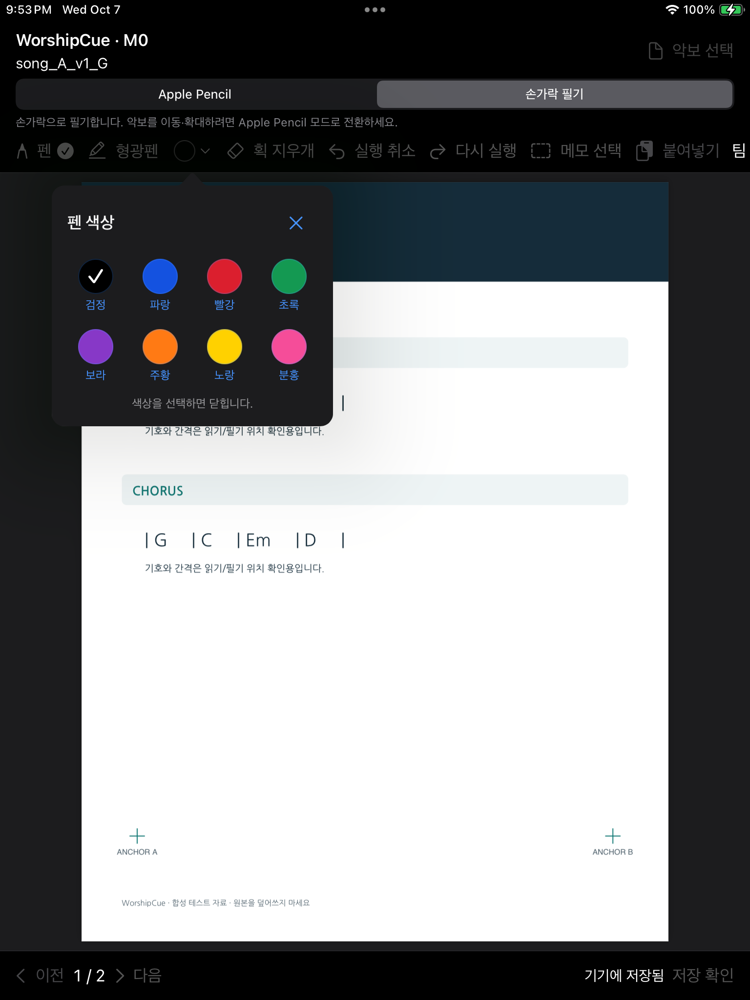
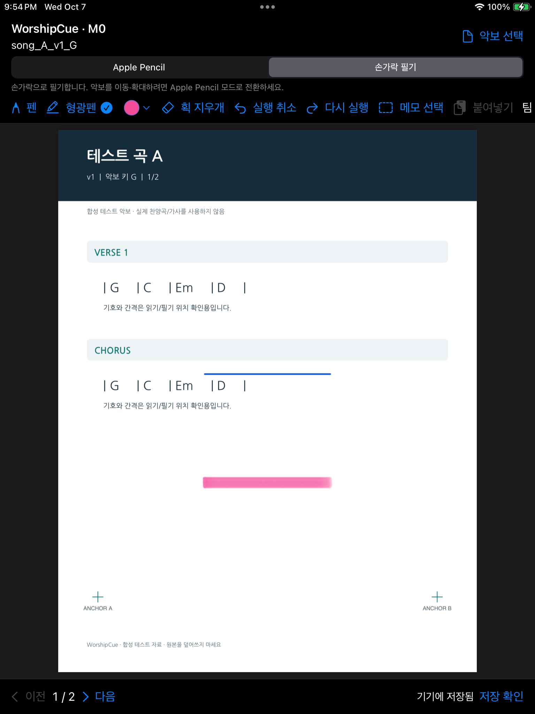

<p align="center">
  
</p>

<h1 align="center">WorshipCue</h1>
<p align="center"><strong>Your charts. Your notes. Your cue.</strong></p>
<p align="center">A Korean-first native iPad music stand for worship teams.</p>
<p align="center">악보와 필기는 각자 편하게. 곡 안내와 팀 필기는 함께.</p>
<p align="center"><a href="README.ko.md">한국어 소개</a> · <a href="#working-today">Working today</a> · <a href="#development">Development</a> · <a href="verification/M0-colors-icon.md">Test evidence</a></p>

## Why WorshipCue exists

Worship musicians prepare more than a PDF. They mark the bridge, circle an entrance, write a voicing, and remember which arrangement they rehearsed. When a revised chart arrives, that work should remain easy to find. When a leader calls an unplanned song, musicians need a clear cue and a moment to choose when to open it.

WorshipCue is being built around those moments: **keep the chart you trust, preserve the notes you made, and stay aware of the team's next move.**

It is for musicians and singers who already rehearse from PDF charts on iPad, and for bandmasters—often leading from the keyboard—who need to communicate changes while performing. The first interface is Korean; the underlying implementation is native Swift, PDFKit and PencilKit.

## What this means in rehearsal

| The moment | The experience WorshipCue is built to provide | Current status |
|---|---|---|
| “The updated arrangement arrived. Where are my notes?” | Keep the original PDF and its notes; select only the markings you want to carry into the new chart. | Immutable imports, version/page-specific ink and manual selected-note transfer implemented. The complete weekly library/version-management UI is planned. |
| “I need to mark this entrance quickly.” | Write or highlight directly on the chart, switch colors in a small popover, and undo without touching the team layer. | Implemented; finger drawing, color selection and recovery tested on a real iPad. Physical Apple Pencil qualification remains open. |
| “We lost Wi-Fi during rehearsal.” | Continue reading local charts and saving personal notes on the device. | Local reading/save/restore implemented. Download preparation and network recovery belong to later milestones. |
| “The bandmaster circled the second chorus.” | See team handwriting on the exact matching chart, with your personal notes kept separate. | Read-only local team sample implemented. Actual shared handwriting and backend permissions are planned. |
| “We're moving to an unplanned song.” | See a quiet song/key cue and tap when you are ready to open it; keep control of your page. | Live announcements are specified and planned; no live backend is running. |

## Working today

The current app is an early **M0 native reliability build**, installed and tested locally on an iPad—not an App Store release or a complete rehearsal pilot.

- **Read PDFs on iPad.** Import from Files into validated, app-owned immutable assets; an import failure preserves the chart already open.
- **Make personal notes.** Pen, highlighter, stroke eraser, undo and redo. Apple Pencil integration is implemented; the visible **손가락 필기** mode supports tested finger drawing.
- **Change colors quickly.** Eight named colors in one compact popover. Pen and highlighter remember separate choices. Select a color, tap ×, or tap outside to close it.
- **Keep notes attached to the right chart.** Ink is stored against the exact version and page. Local save status follows a database commit, with recovery and save-failure handling.
- **Move selected notes deliberately.** Select strokes, copy, choose a destination, drag/scale the paste preview, then confirm or cancel. The source notes stay intact; a committed paste can be undone.
- **Keep your own place.** Page turns are local. The reader remembers its chart/page and restores locally saved notes after reopening.
- **Inspect separate team ink.** A read-only sample demonstrates exact-version/page isolation. It is a local development example, not a synchronization service.

### Actual app screens

These screenshots come from device UI tests using synthetic charts and isolated test stores. They show the running app, not proposed designs or private musician handwriting.

<p align="center">
  
  
</p>

The more polished layouts in [UI concepts](docs/ui-concepts/README.md) are design explorations for later milestones.

## The musician stays in control

These are fixed product decisions, not optional follow modes:

- **You choose when a song opens.** Planned announcements require a tap; receiving a cue or reconnecting must preserve the currently open chart.
- **You turn your own pages.** There is no page synchronization.
- **Your notes belong to the paper you marked.** Published charts are immutable. Transfer is manual; there is no automatic note merging or guessed alignment.
- **Personal and team notes have separate layers.** Shared ink must match the exact performance item, chart version and page. Other versions require a preview rather than an overlay.
- **A key label is information.** Changing metadata does not transpose PDF chords or notation.

The current build uses local development identities. Managed accounts, church membership, guest access and server-enforced privacy still require implementation and verification.

## What comes next

The [milestone plan](docs/12_BUILD_PLAN.md) builds outward from reliable reading and handwriting:

1. **Weekly preparation:** Korean search, library metadata, individual charts and song ranges inside weekly PDF packets, setlists, preferred versions and fallback export.
2. **A private team workspace:** managed accounts, scoped guests, verified downloads and personal-note synchronization with explicit conflict handling.
3. **Shared rehearsal markings:** bandmaster circles, arrows and handwriting tied to the exact chart and performance context.
4. **Live song/key cues:** a visual latest-cue banner, explicit tap-to-open and a separate recent-call history.
5. **Rehearsal qualification:** oldest-device testing, offline/recovery work, long sessions and real musicians using the app before a release.

These features are planned, not available services. No hosted backend, billing or public distribution is enabled.

## Development

### Run the native app

The deployment target is **iPadOS 16.0**. The currently tested physical device is an **iPad (6th generation), iPadOS 17.7.11**. The original 16.7.16 iPad and physical Apple Pencil still need qualification.

Use macOS with an iOS SDK and a Swift 6.1+ toolchain. Current successful Debug/device and Release build evidence uses Xcode 27.0. GRDB is pinned to 7.11.1. The latest Xcode 26.6 asset build is blocked by an absent simulator runtime; see the exact test record.

```sh
git clone https://github.com/manynames3/WorshipCue.git
cd WorshipCue
open apps/ipad/WorshipCue.xcodeproj
```

Choose scheme **WorshipCue** and your available iPad or installed simulator. Configure your own development signing locally for device runs. The current local device setup uses a free Personal Team; no paid enrollment was purchased. Keep signing identities and device identifiers out of commits.

See [native setup and test commands](apps/ipad/README.md). The existing [external-drive toolchain setup](docs/13_EXTERNAL_XCODE_SETUP.md) is optional; scripts support `WORSHIPCUE_XCODE_APP` and `WORSHIPCUE_TOOLS_ROOT` overrides for a different local layout.

### Check the reference contracts and local storage

With Xcode's developer tools selected:

```sh
swift test --package-path reference/WorshipCueCore
swift run --package-path packages/WorshipCueLocal InkChecks

python3 -m venv .venv
.venv/bin/python3 -m pip install -r scripts/requirements.txt
.venv/bin/python3 scripts/verify_package.py
python3 scripts/verify_m0_project.py
```

Scheme **WorshipCue** contains hosted native tests; **WorshipCueUI** also contains device UI workflows. Tests use isolated stores and synthetic PDFs. The real-device script accepts privately supplied signing/device environment variables; it does not hard-code credentials.

### Verification status · 2026-10-07

| Evidence | Recorded result |
|---|---|
| Latest color and black-pen device UI workflows | **2 passed** on iPadOS 17.7.11, including rendered ink, dismissal, undo/redo and cold relaunch. |
| Latest focused native checks | **2 passed**, covering color persistence and actual PDFKit overlay input/appearance. |
| Xcode 27 Release build | **Passed**, with iPadOS 16.0 deployment target. |
| Earlier M0 baseline | 13 hosted native tests; separate drawing and team-isolation UI workflows passed. Earlier functional transfer passed; final transfer requalification remains blocked. |
| Reference/specification/local-store baseline | 55 Swift tests, 32 Python tests, 9 local-store check groups and 4 macOS framework check groups passed. |
| Full current native suite | 14 cases exist; the latest full rerun stalled before case execution and was interrupted. No full-suite passing claim. |
| Remaining physical gates | Original iPadOS 16 device, Apple Pencil, memory/thermal/resume and multi-iPad behavior **not verified**. |

See [Build 2 evidence](verification/M0-colors-icon.md), [M0 history](verification/M0.md) and the [device checklist](verification/M0-device-checklist.md). Separate successful runs do not imply one clean combined run or pilot readiness.

## Repository map

| Path | Purpose |
|---|---|
| [`apps/ipad`](apps/ipad) | Native reader, annotation tools, asset catalog and hosted/UI tests. |
| [`packages/WorshipCueLocal`](packages/WorshipCueLocal) | Transactional local ink storage and page geometry. |
| [`packages/WorshipCueInk`](packages/WorshipCueInk) | Selected-stroke clipboard and placement logic. |
| [`reference/WorshipCueCore`](reference/WorshipCueCore) | Pure domain rules and executable reference tests; also used by the app. |
| [`contracts`](contracts), [`db`](db) | Contracts and local schema specifications; not a deployed backend. |
| [`fixtures`](fixtures) | Synthetic charts and validation cases. |
| [`docs`](docs) | Product decisions, UX, architecture, rights and milestone specifications. |
| [`verification`](verification) | Test summaries, limitations and selected synthetic screenshots. Raw build logs and device bundles stay local. |

For implementation work, start with [AGENTS.md](AGENTS.md), [decisions](docs/02_DECISIONS.md) and [PROJECT_STATE.md](PROJECT_STATE.md). The [original handoff README](docs/HANDOFF_README_v1.md) is preserved as historical context.

## Charts, privacy and licensing

Only synthetic charts are included. Musicians and churches must have permission for the charts they import and share; WorshipCue does not provide a commercial song catalog or a music license. Rights and planned access controls are described in [security and rights](docs/10_SECURITY_AND_RIGHTS.md).

Third-party dependency notices are included in the [app notices](apps/ipad/WorshipCue/ThirdPartyNotices.txt). No open-source license has been granted for WorshipCue's own source in this repository.
