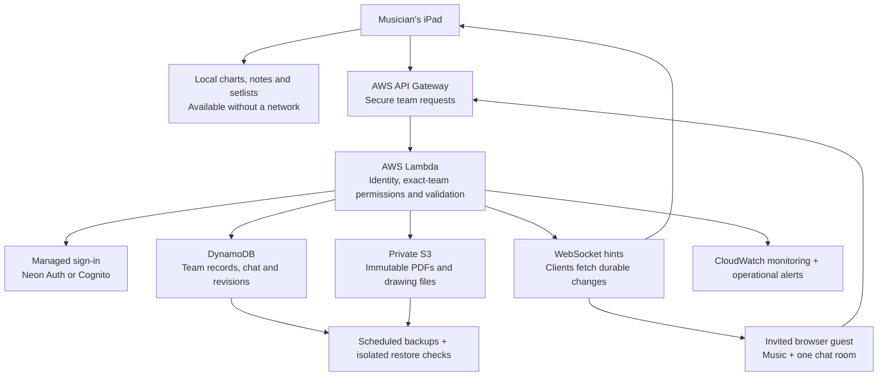

# Engineering WorshipCue

[Product overview](../README.md) · [Feature and fix history](../CHANGELOG.md) · [Verification status](../verification/STATUS.md)

WorshipCue is a product and engineering project by [Aiden Rhaa](https://github.com/manynames3). The work spans a native iPad experience, persistent drawing and document geometry, a permissioned cloud backend, authentication integration, a browser companion, and operational recovery. The design starts with what a musician needs during rehearsal: readable music, trustworthy notes, and control over when the next chart opens.

This guide describes the current development implementation. Builds 9–19 include local work beyond the published Build 8 source checkpoint; see the [publication status](../verification/STATUS.md#publication-and-builds).

## Architecture at a glance

Neon currently supplies an alternative managed sign-in route; the team database, files and messaging remain on AWS. Browser guests receive narrowly scoped access through invitations. Their original PDFs are rendered with pinned, self-hosted PDF.js. The browser companion does not edit native ink or expose the entire team library.

The system uses on-demand managed services and foreground WebSocket connections. No provisioned-concurrency pool was added. Stored data, backups, monitoring and actual usage still incur costs; this is not a claim of a zero-cost backend.

## Decisions that serve the musician

| Product requirement | Engineering choice | Why it matters |
| --- | --- | --- |
| A musician must finish the current phrase before changing songs. | A cue is visual information. Opening a song requires an explicit tap; pages remain local. | Team coordination does not take over the music stand. |
| A revised arrangement must not erase rehearsal work. | Imported/published PDFs are immutable; personal ink belongs to its owner, exact chart version and page. Transfer is selected and confirmed manually. | Old notes remain interpretable, and misplaced marks are not silently merged. |
| Wi-Fi failure must not make a prepared chart unreadable. | App-owned local files, transactional persistence, verified downloads and atomic cache promotion. | A network success response alone cannot label a chart ready. |
| Personal practice notes must stay personal. | Separate personal/team layers, exact-team authorization and account-scoped local stores/credentials. | Church membership or an admin role does not grant another musician's private ink. |
| Repeating a send after a lost response must be safe. | Persisted command IDs, frozen publication requests and durable chat actions with explicit retries. | The app can reconcile an uncertain result without inventing a new operation. |
| Live updates must recover after a disconnect. | WebSockets signal changes; clients re-read authorized durable state. | A missed notification does not become a missing conversation or an automatic chart change. |

Native responsibilities use Swift/SwiftUI, PDFKit and PencilKit. SQLite persistence uses pinned GRDB. Pure domain rules live separately from UI frameworks, so chart identity, cue behavior and conflict rules can be tested independently. The Python backend validates PDF content and geometry before publication.

## Debugging that changed the implementation

**Managed login handoff.** A provider could verify an email code while the app still reported a connection failure. A reproduced Python 3.13 cookie-parser incompatibility explained an adapter failure that local Python 3.14 tests had missed. Session-cookie selection was corrected and the credential still had to pass managed-provider validation. A fresh real native test subsequently verified sign-in, Keychain storage, team creation, durable chat and restoration through a new workspace instance.

**Resend recovery.** A failed resend had reset the code-entry step, hiding the field. Request-step state now remains separate from delivery success. Resending clears the old code and retains the blank field; a failed resend does not discard a prior exact-email challenge or extend its validity. A focused device UI regression passed.

**Chat read state.** Richer message layouts exposed a mismatch between message bounds and viewport coordinates. Visibility now uses matching coordinates, so offscreen messages are not marked read. The final focused native chat suite passed 12 cases. Conversation captures use synthetic data and controlled transport; they are not evidence of a live multi-iPad conversation.

**Page navigation.** Repeated page work was reduced through cached metadata, coalesced loading and avoiding unchanged-ink serialization. On two privately supplied arranger PDFs, 80 alternating arrow turns yielded rendered p95 values of 123.52–140.72 ms, including scenarios with 300 strokes. This measurement excludes gesture recognition. Later swipe regressions reproduced premature failure when one finger briefly led the other and overly strict diagonal rejection. The classifier was corrected; final post-zoom gesture handoff and physical swipe feel remain unverified.

**Burst capacity.** A raw 50-client test failed under the development account's applied Lambda concurrency limit and HTTP admission settings. The prepared increase is protected by a deployment preflight and a change-set check that permits only the intended stage settings. It has not been deployed while additional headroom is unavailable. A paced comparison is recorded separately and is not called a successful burst test.

## Verification and preservation

The project checks failure paths as well as successful flows: exact chart identity, cross-team denial, immutable file publication, conflicting note revisions, authentication revocation, retry behavior and preservation across app updates. Device checks use isolated stores; private charts, codes, credentials and raw device artifacts stay outside Git.

The latest installation comparison confirmed seven PDF paths and hashes and five complete personal-ink rows unchanged, with four SQLite integrity checks OK. An isolated cloud restore separately matched 1,489 stable rows and verified nine assets. These are bounded development checks, not a claim of unlimited archive recovery or production readiness.

Read the [verification summary](../verification/STATUS.md) for exact scopes, failed runs and outstanding device/service gates. [Product decisions](https://github.com/manynames3/WorshipCue/blob/v2/docs/02_DECISIONS.md) and the [build plan](https://github.com/manynames3/WorshipCue/blob/v2/docs/12_BUILD_PLAN.md) preserve the published design history.
